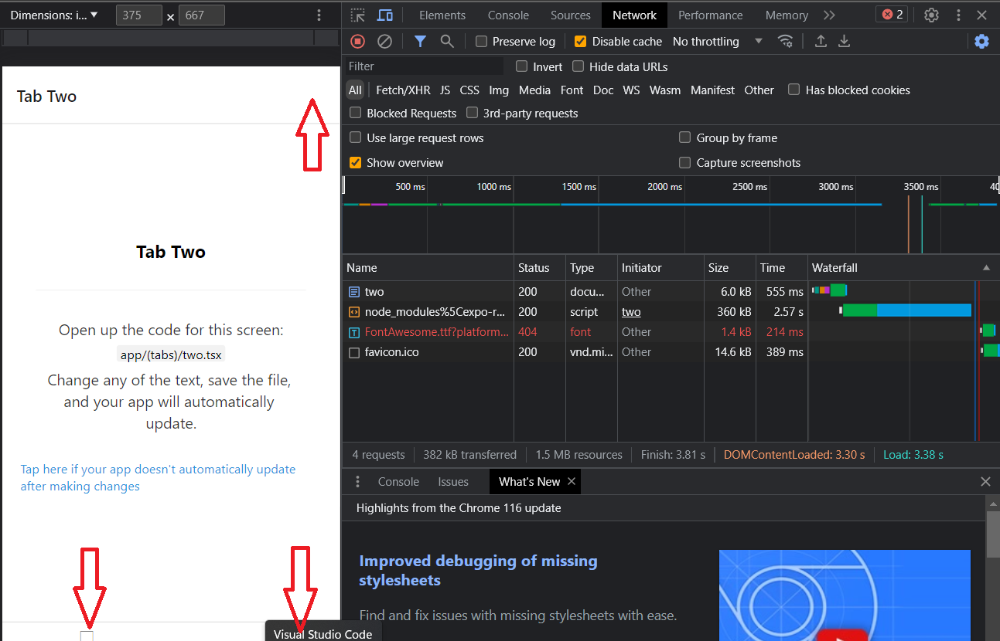
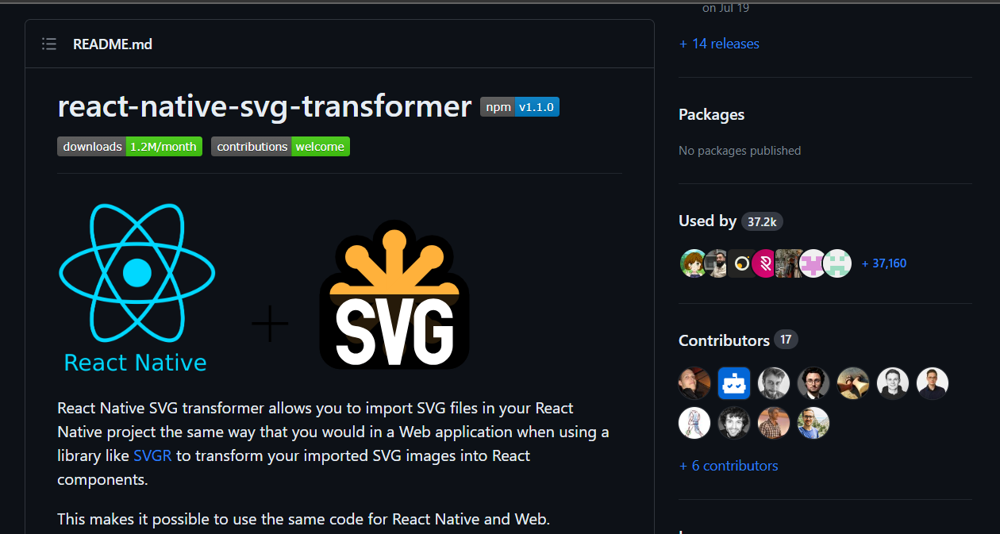
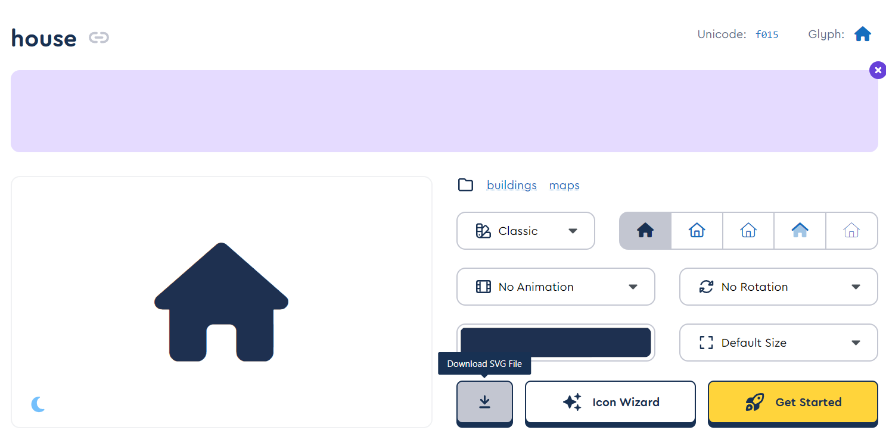

<!-- Banner Image -->

  <a href="https://expo.dev/">
    
    <h1 align="center">Expo Router v2 </h1>
    <h2 align="center">step by step tutorial </h2>
    <h3>Building Apps for Crafting Static Websites for Google and Other Social Networks, as well as a Mobile App for iOS and Android  </h3>
  </a>
<h5 align="center"> <a aria-label="expo documentation" href="https://maps.menu">maps.menu 📚</a></h5>

  <a aria-label="try expo with snack" href="https://github.com/bolshiyanov/expo-router-v2-step1"><b>This 1 step</b></a>
 | <a aria-label="try expo with snack" href="https://expo-router-v2-static-web-app-step-2.netlify.app/"><b>Look web site for 2 step</b></a>
 |
  <a aria-label="expo documentation" href="https://github.com/bolshiyanov/expo-router-v2-step3">Next 3 step 📚</a>

---

- [📚 About this step](#-documentation)
- [🗺 Stack of this step](#-Stack-of-this-step)
- [🏅 Why expo-router v2](#-Why-expo-router)
- [❓ FAQ](#-faq)
- [💙 The Team](#-the-team)
- [License](#license)

<h2 align="center">In this step will fix problem in Expo with expo/vector-icons  after export to Web </h2>

In this tutorial, we embark on a step-by-step journey to construct a static website on React-Native using expo-router v2. Our goal is to build a website builder and mobile app constructor all in one, with maximum search optimization. The project itself spans a considerable scope, encompassing a Multilingual Website Constructor, user registration, payment capabilities, and an array of other features.

In the upcoming chapters, we will establish the foundation of this site's structure and introduce a multitude of navigational possibilities. As we progress, we'll lay the groundwork for seamless navigation and explore the potential for dynamic, user-centric experiences.

## 📚 About this step

This article addresses the challenge of icon display issues with Expo/vector-icons during static site export in React projects. It explores the problem, outlines the steps to set up SVG icons, and offers a comprehensive guide to ensure icons are seamlessly integrated, empowering users to craft custom icons and enhance their app's style.

## 🗺  Step-by-Step Guide: 

Solving Icon Issues with Expo/vector-icons during Static Site Export in React 

As we rejoiced over the impressive template of a static site that Expo Router v2 had provided, a predicament quickly emerged: after exporting via metro.config in Expo, we faced a challenge with Expo/vector-icons. As you can see in the image below, the icons were either missing or replaced by rectangles. A disheartening setback indeed. 

In my pursuit of a solution, I scoured the internet and stumbled upon pages like this: [https://github.com/expo/expo/issues/21568](https://github.com/expo/expo/issues/21568).  

I spent considerable time experimenting with importing icons using React Native and React, but to no avail. After attempts at building, if successful at all, the outcome remained unchanged: the icons were not displaying in my Expo application. 

But is this a setback? Quite the opposite – it's an opportunity. 

As a reminder, we're creating a website and mobile app builder that empowers anyone to craft their own site for Google or other social platforms, free of charge.  

This implies that our users would undoubtedly be disappointed if the potential of our builder was limited by the scope of expo/vector-icons. 

In other words, I decided not to confine myself to Expo/vector-icon icons. Instead, I aimed to create a foundation that would enable users to generate icons from any SVG file in the future. Large or small icons, colored or monochrome – any icons for Expo. 

Let's get to the heart of the matter. 

To address this, we will set up our project to work with SVG images: 

1. Store icons in the assets folder. 
2. Install the necessary dependencies:  - `npm i react-native-svg.` 
3. Install the second dependency:  - `npm i react-native-svg-transformer`  and configure them as outlined in this guide:  [https://github.com/kristerkari/react-native-svg-transformer#readme](https://github.com/kristerkari/react-native-svg-transformer#readme). 

4. Create a file metro.config.js in the root directory with the following content:
<br/ 
`// Learn more https://docs.expo.io/guides/customizing-metro` 
`const { getDefaultConfig } = require("expo/metro-config");` 
 
`module.exports = (() =>`{ 
`const config = getDefaultConfig(__dirname,`{ 
    `isCSSEnabled: true,` 
`});` 
 
`const { transformer, resolver } = config;` 
 
`config.transformer =`{ 
    `...transformer,` 
    `babelTransformerPath: require.resolve("react-native-svg-transformer"),` 
`}`; 
`config.resolver =`{ 
    `...resolver,` 
    `assetExts: resolver.assetExts.filter((ext) => ext !== "svg"),` 
    `sourceExts: [...resolver.sourceExts, "svg"],` 
`};` 
  
` return config;` 
`})();`] 
 

5. Create a declarations.d.ts file in the root directory with the following content: 

- [`declare module "*.svg" `]{ 
    - [`import React from "react";`] 
    - [`import { SvgProps } from "react-native-svg";`] 
    - [`const content: React.FC<SvgProps>;`] 
    - [`export default content; `]
 
 

6. Open [https://fontawesome.com/](https://fontawesome.com/) and download the required icons to the "icons" folder that we created for this purpose. 

7. Use npm start to launch our project. 

8. Update imports accordingly. 

9. Revise icon usage. Unlike with expo/vector-icons, with SVG we use "fill" instead of "color." Also, specify dimensions using width and height. 

10. Finally, execute npx expo export -p web and examine the outcome. 

We now have icons for Expo that are not limited by style or quantity as in expo/vector-icons. Users can not only select icons from the existing pool but also incorporate custom-made icons that align with the app's style. 

Additionally, I recommend opening the link on your phone and toggling between light and dark themes. Observe how this new template from Expo Router v2 adapts to the device's color scheme. 

Kudos to the developers of this tabs template – our start has been truly impressive. 

Have you encountered any icon issues with Expo? I'll give you a hint: the back arrow is missing in the modal window. 

Download this repository to your computer. Run npm init followed by npm start and try adding your own arrow to the modal window panel. 

In the next segment, we'll delve into exploring other navigators. We'll create an app using the Drawer navigator, face an unsolvable navigation challenge, and most likely revert back to the original version of the app.

## 🗺 Stack of this step

- [`expo-router-v2`](expo-router-v2) Supported static web generation, css , seo.
- [`expo-router`]( expo-router) There is no specific package called "expo-router." Expo uses React Navigation for routing
- [`expo`](expo) Expo is a platform simplifying React Native development through tools, libraries, and workflow enhancements.
- [`react-dom`](react-dom)React package enabling rendering of components in the web browser's DOM (Document Object Model).
- [`react native`](react-native) JavaScript framework for building cross-platform mobile applications.
- [`react`](react) JavaScript library for building user interfaces, maintained by Facebook and a community.
- [`typescript`](typescript) TypeScript is a superset of JavaScript adding static typing for enhanced code quality and tooling.
- [`gitHub`](gitHub) GitHub is a web-based platform for version control and collaboration using Git.
- [`netlify`](netlify) Netlify is a web hosting platform for deploying and managing modern web projects.

## 🏅 Why expo-router v2

 landscape of modern business, the effectiveness of customer acquisition and retention takes on profound importance. The intersection where the cost of drawing in initial customers converges with the metrics of retention and Lifetime Value establishes a pivotal nexus for real-world enterprises. It's within this context that businesses frequently navigate towards the realm of search engine optimization, leveraging its potential to tap into organic traffic from behemoths like Google. 

Undoubtedly, a website serves as an inviting initial point of contact between the business and potential clientele. However, its true value shines when users willingly return, reinforcing the need for a captivating and compelling platform. This brings us to the second interaction with customers, where the objective shifts to providing a seamless, native application experience tailored for iPhones and Android devices. Hence, discerning businesses harmonize their approach by upholding a static website for search engine visibility and a dynamic mobile application for app marketplaces. 

Until recently, achieving such intricate synergy was primarily the domain of expansive teams like Twitter. This involved intricate orchestration of web and native components by scores of developers. Yet, the landscape has metamorphosed with the emergence of Expo Router Version 2. This paradigm shift has overhauled the development process, empowering developers to craft code within a unified ecosystem and effortlessly export the final product as both a static website and a feature-rich app available on the Play Store. 

Moreover, the realm of possibilities has expanded to encompass wearable gadgets, such as the Apple Watch, thanks to Expo Router's extended support. In mere minutes, updates can be seamlessly integrated, thereby revolutionizing the agility with which businesses can refine their offerings. This ushers in an unmatched opportunity to harness the complete potential of the internet, propelling businesses towards the attainment of their goals. 

The democratization of this robust framework marks a monumental stride forward. The once imposing barriers that impeded smaller entities from realizing their digital ambitions have now dissolved. Expo Router introduces an era of accessibility, bestowing entrepreneurs and businesses alike with the means to bridge the gap between their vision and its actualization. As businesses embark on this journey, they gain the capability to enthrall audiences, nurture loyalty, and elevate their digital footprint – all while streamlining the development process in ways that were once the exclusive domain of a select few. 

In a world where triumph pivots on the symbiotic interplay between innovation and execution, Expo Router stands as a testament to technology's power to democratize opportunities. It embodies the shift that has unfolded in the landscape of app and web development – transitioning from the intricate and unwieldy to the intuitive and efficient. As businesses embrace this evolution, they set out on a transformative trajectory, shedding the constraints of the past and venturing into a future where every aspiration for digital resonance and engagement can be woven into reality. 

## 💙 Author

Roman Bolshiyanov < status : open for cooperation, look job >

## License

The Expo source code is made available under the [MIT license](LICENSE). Some of the dependencies are licensed differently, with the BSD license, for example.

